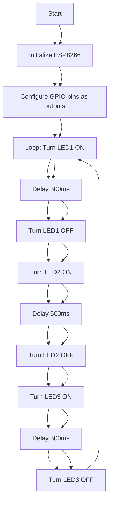

# மூன்று LED-களை ESP8266 ஐப் பயன்படுத்தி ஒளிரச் செய்தல்  
Blinking Three LEDs Using ESP8266

## திட்டக் கண்ணோட்டம்  
Project Overview  
இந்தத் திட்டம் ESP8266 மைக்ரோகண்ட்ரோலருடன் இணைக்கப்பட்ட மூன்று LED-களை கட்டுப்படுத்தி, அவற்றை வரிசையாக ஒளிரச் செய்வதை விளக்குகிறது.  
This project demonstrates how to control three LEDs connected to an ESP8266 microcontroller, making them blink in a sequential pattern.  
ESP8266 ஒரு பல்துறை Wi-Fi இயக்கப்பட்ட மைக்ரோகண்ட்ரோலர் ஆகும், மேலும் இந்தத் திட்டம் பல்வேறு மேம்பாட்டு சூழல்களைப் பயன்படுத்தி இதை நிரலாக்குவதற்கு ஆரம்பநிலையாளர்களுக்கு உகந்த அறிமுகமாக உள்ளது.  
The ESP8266 is a versatile Wi-Fi-enabled microcontroller, and this project serves as a beginner-friendly introduction to programming it using different development environments.  
LED-கள் GPIO பின்களுடன் இணைக்கப்பட்டுள்ளன, மேலும் குறியீடு அவற்றை குறிப்பிட்ட தாமதத்துடன் ஆன் மற்றும் ஆஃப் செய்கிறது.  
The LEDs are connected to GPIO pins, and the code toggles them on and off with a specified delay.

## ஓட்ட விளக்கப்படம்  
Flow Chart  


## தேவையான மென்பொருள்  
Software Required  
- **Arduino IDE**: பதிப்பு 2.3.2 அல்லது அதற்கு மேல் ([arduino.cc](https://www.arduino.cc/en/software) இலிருந்து பதிவிறக்கவும்).  
  **Arduino IDE**: Version 2.3.2 or later (download from [arduino.cc](https://www.arduino.cc/en/software)).  
- **PlatformIO**: விஷுவல் ஸ்டுடியோ கோடுக்கான நீட்டிப்பு ([platformio.org](https://platformio.org/) இலிருந்து நிறுவவும்).  
  **PlatformIO**: Extension for Visual Studio Code (install from [platformio.org](https://platformio.org/)).  
- **ArduinoDroid**: ஆண்ட்ராய்டுக்கான மொபைல் பயன்பாடு (கூகுள் பிளே ஸ்டோரில் கிடைக்கும்).  
  **ArduinoDroid**: Mobile app for Android (available on Google Play Store).  
- **ESP8266 போர்டு ஆதரவு தொகுப்பு**: Arduino IDE மற்றும் PlatformIO இல் ESP8266 ஐ நிரலாக்க தேவை.  
  **ESP8266 Board Support Package**: Required for Arduino IDE and PlatformIO to program the ESP8266.  
- **USB இயக்கி**: USB-க்கு-சீரியல் தொடர்புக்கு CH340/CH341 இயக்கி (ஏற்கனவே நிறுவப்படவில்லை என்றால்).  
  **USB Driver**: CH340/CH341 driver for USB-to-serial communication (if not already installed).  

## தேவையான வன்பொருள்  
Hardware Required  
- ESP8266 தொகுதி (எ.கா., NodeMCU அல்லது ESP-01).  
  ESP8266 module (e.g., NodeMCU or ESP-01).  
- மூன்று LED-கள் (எந்த நிறமாக இருந்தாலும்).  
  Three LEDs (any color).  
- மூன்று 220Ω மின்தடையங்கள் (LED-களுக்கு மின்னோட்டத்தை வரம்பிட).  
  Three 220Ω resistors (to limit current to LEDs).  
- பிரெட்போர்டு மற்றும் ஜம்பர் கம்பிகள்.  
  Breadboard and jumper wires.  
- USB கேபிள் (Type-A to Micro-USB அல்லது USB-C, ESP8266 தொகுதியைப் பொறுத்து).  
  USB cable (Type-A to Micro-USB or USB-C, depending on the ESP8266 module).  
- நிரலாக்கத்திற்கு கணினி அல்லது ஆண்ட்ராய்டு சாதனம்.  
  Computer or Android device for programming.  

## Arduino IDE ஐப் பயன்படுத்தி நிரலாக்கம்  
Programming Using Arduino IDE  
1. **Arduino IDE ஐ நிறுவவும்**:  
   **Install Arduino IDE**:  
   - [arduino.cc](https://www.arduino.cc/en/software) இலிருந்து Arduino IDE ஐ பதிவிறக்கி நிறுவவும்.  
     Download and install Arduino IDE from [arduino.cc](https://www.arduino.cc/en/software).  
2. **ESP8266 போர்டு ஆதரவைச் சேர்க்கவும்**:  
   **Add ESP8266 Board Support**:  
   - `File > Preferences` க்கு சென்று, "Additional Boards Manager URLs" இல் `https://arduino.esp8266.com/stable/package_esp8266com_index.json` ஐச் சேர்க்கவும்.  
     Go to `File > Preferences`, add `https://arduino.esp8266.com/stable/package_esp8266com_index.json` to the "Additional Boards Manager URLs."  
   - `Tools > Board > Boards Manager` இல், "ESP8266" ஐத் தேடி தொகுப்பை நிறுவவும்.  
     In `Tools > Board > Boards Manager`, search for "ESP8266" and install the package.  
3. **வன்பொருளை இணைக்கவும்**:  
   **Connect Hardware**:  
   - LED-களை GPIO பின்களுடன் (எ.கா., D1, D2, D3) 220Ω மின்தடையங்களுடன் தொடரில் இணைக்கவும்.  
     Connect LEDs to GPIO pins (e.g., D1, D2, D3) with 220Ω resistors in series to ground.  
   - ESP8266 ஐ USB வழியாக உங்கள் கணினியுடன் இணைக்கவும்.  
     Connect the ESP8266 to your computer via USB.  
4. **குறியீட்டை பதிவேற்றவும்**:  
   **Upload Code**:  
   - `Tools > Board` இல் உங்கள் ESP8266 போர்டை (எ.கா., `NodeMCU 1.0`) தேர்ந்தெடுக்கவும்.  
     Select your ESP8266 board (e.g., `NodeMCU 1.0`) under `Tools > Board`.  
   - பின்வரும் குறியீட்டை Arduino IDE இல் நகலெடுத்து ஒட்டவும்.  
     Copy and paste the following code into the Arduino IDE.  
   - ESP8266 ஐ நிரலாக்க `Upload` ஐ கிளிக் செய்யவும்.  
     Click `Upload` to program the ESP8266.  

```cpp
#define LED1 D1
#define LED2 D2
#define LED3 D3

void setup() {
  pinMode(LED1, OUTPUT);
  pinMode(LED2, OUTPUT);
  pinMode(LED3, OUTPUT);
}

void loop() {
  digitalWrite(LED1, HIGH);
  delay(500);
  digitalWrite(LED1, LOW);
  digitalWrite(LED2, HIGH);
  delay(500);
  digitalWrite(LED2, LOW);
  digitalWrite(LED3, HIGH);
  delay(500);
  digitalWrite(LED3, LOW);
}
```

## PlatformIO (VS Code) ஐப் பயன்படுத்தி நிரலாக்கம்  
Programming Using PlatformIO (VS Code)  
1. **PlatformIO ஐ நிறுவவும்**:  
   **Install PlatformIO**:  
   - [code.visualstudio.com](https://code.visualstudio.com/) இலிருந்து விஷுவல் ஸ்டுடியோ கோடை நிறுவவும்.  
     Install Visual Studio Code from [code.visualstudio.com](https://code.visualstudio.com/).  
   - Extensions Marketplace வழியாக PlatformIO நீட்டிப்பைச் சேர்க்கவும்.  
     Add the PlatformIO extension via the Extensions Marketplace.  
2. **புதிய திட்டத்தை உருவாக்கவும்**:  
   **Create a New Project**:  
   - PlatformIO ஐ திறந்து, `New Project` ஐ கிளிக் செய்து, உங்கள் ESP8266 போர்டை (எ.கா., `NodeMCU`) தேர்ந்தெடுத்து, Arduino framework ஐ தேர்வு செய்யவும்.  
     Open PlatformIO, click `New Project`, select your ESP8266 board (e.g., `NodeMCU`), and choose the Arduino framework.  
3. **வன்பொருளை அமைக்கவும்**:  
   **Configure Hardware**:  
   - மேல