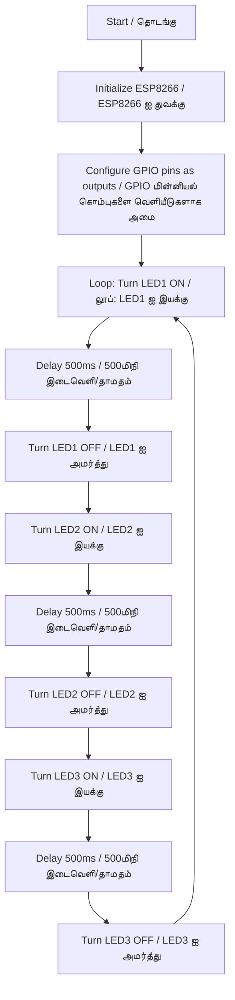

# மூன்று LED-களை (ஒளி உமிழ் இருமுனையம்) ESP8266 ஐப் பயன்படுத்தி ஒளிரச் செய்தல்  
Blinking Three LEDs Using ESP8266

## திட்டக் கண்ணோட்டம்  
Project Overview 

இந்தத் திட்டம் ESP8266 நுண்கட்டுப்படுத்தியுடன் இணைக்கப்பட்ட மூன்று LED-களை கட்டுப்படுத்தி, அவற்றை வரிசையாக ஒளிரச் செய்வதை விளக்குகிறது. ESP8266 ஒரு பல்துறை Wi-Fi இயக்கப்பட்ட நுண்கட்டுப்படுத்தி ஆகும், மேலும் இந்தத் திட்டம் பல்வேறு மேம்பாட்டு சூழல்களைப் பயன்படுத்தி இதை நிரலாக்குவதற்கு ஆரம்பநிலையாளர்களுக்கு உகந்த அறிமுகமாக உள்ளது. LED-கள் GPIO மின்னியல் கொம்புகளுடன் இணைக்கப்பட்டுள்ளன, மேலும் குறியீடு அவற்றை குறிப்பிட்ட இடைவெளியுடன் இயக்கவும் அமர்த்தவும் செய்கிறது.

This project demonstrates how to control three LEDs connected to an ESP8266 microcontroller, making them blink in a sequential pattern. The ESP8266 is a versatile Wi-Fi-enabled microcontroller, and this project serves as a beginner-friendly introduction to programming it using different development environments. The LEDs are connected to GPIO pins, and the code toggles them on and off with a specified delay.

## செயல்வழிப் படம் 
Flow Chart  

## தேவையான மென்பொருள்  
Software Required  

விண்டோஸ்
(Windows)

- **Arduino IDE**: பதிப்பு 2.3.2 அல்லது அதற்கு மேல் ([arduino.cc](https://www.arduino.cc/en/software) இலிருந்து பதிவிறக்கவும்).  
  **Arduino IDE**: Version 2.3.2 or later (download from [arduino.cc](https://www.arduino.cc/en/software)). 

  அல்லது (or)

- **Visual Studio Code**: விஷுவல் ஸ்டுடியோ கோடு: code.visualstudio.com இலிருந்து பதிவிறக்கி, Extensions Marketplace இலிருந்து PlatformIO விரிவாக்கத்தை நிறுவவும்.
  **விஷுவல் ஸ்டுடியோ கோடு**: Visual Studio Code: Download from code.visualstudio.com and install the PlatformIO extension from the Extensions Marketplace.

ஆண்ட்ராய்டு
(Android)
- **ArduinoDroid**: ஆண்ட்ராய்டு கைபேசிக்கான செயலி (கூகுள் பிளே ஸ்டோரில் கிடைக்கும்).  
  **ArduinoDroid**: Mobile app for Android (available on Google Play Store).  

## தேவையான வன்பொருள்  
Hardware Required  
- ESP8266 தொகுதி.  
  ESP8266 module (e.g., NodeMCU).  
- மூன்று LED-கள் (எந்த நிறமாக இருந்தாலும் சரி).  
  Three LEDs (any color).  
- மூன்று 220Ω மின்தடையி (LED-களுக்கு மின்னோட்டத்தை வரம்பிட).  
  Three 220Ω resistors (to limit current to LEDs). s 
- மின்னணுவியல் பலகை மற்றும் இணைப்பு கம்பிகள்.  
  Breadboard and jumper wires.  
- USB கேபிள் (Type-A to Micro-USB அல்லது USB-C, ESP8266 தொகுதியைப் பொறுத்து).  
  USB cable (Type-A to Micro-USB or USB-C, depending on the ESP8266 module).  
- நிரலாக்கத்திற்கு கணினி அல்லது ஆண்ட்ராய்டு சாதனம்.  
  Computer or Android device for programming.  

## Arduino IDE ஐப் பயன்படுத்தி நிரலாக்கம்  
Programming Using Arduino IDE  
1. **Arduino IDE ஐ நிறுவவும்**:  
   **Install Arduino IDE**:  
   - [arduino.cc](https://www.arduino.cc/en/software) இலிருந்து Arduino IDE ஐ பதிவிறக்கி நிறுவவும்.  
     Download and install Arduino IDE from [arduino.cc](https://www.arduino.cc/en/software).  
2. **ESP8266 பலகைக்கான ஆதரவைச் சேர்க்கவும்**:  
   **Add ESP8266 Board Support**:  
   - `File > Preferences` க்கு சென்று, "Additional Boards Manager URLs" இல் `https://arduino.esp8266.com/stable/package_esp8266com_index.json` ஐச் சேர்க்கவும்.  
     Go to `File > Preferences`, add `https://arduino.esp8266.com/stable/package_esp8266com_index.json` to the "Additional Boards Manager URLs."  
   - `Tools > Board > Boards Manager` இல், "ESP8266" ஐத் தேடி தொகுப்பை நிறுவவும்.  
     In `Tools > Board > Boards Manager`, search for "ESP8266" and install the package.  
3. **வன்பொருளை இணைக்கவும்**:  
   **Connect Hardware**:  
   - LED-களை GPIO மின்னியல் கொம்புகளுடன் (எ.கா., D1, D2, D3) 220Ω மின்தடையிகளுடன் தொடரில் இணைக்கவும்.  
     Connect LEDs to GPIO pins (e.g., D1, D2, D3) with 220Ω resistors in series to ground.  
   - ESP8266 ஐ USB (அகிலத் தொடர் பாட்டை) வழியாக உங்கள் கணினியுடன் இணைக்கவும்.  
     Connect the ESP8266 to your computer via USB.  
4. **குறியீட்டை பதிவேற்றவும்**:  
   **Upload Code**:  
   - `Tools > Board` இல் உங்கள் ESP8266 போர்டை (எ.கா., `NodeMCU 1.0`) தேர்ந்தெடுக்கவும்.  
     Select your ESP8266 board (e.g., `NodeMCU 1.0`) under `Tools > Board`.  
   - நீங்கள் உங்கள் சொந்த நிரலை உருவாக்கலாம் அல்லது கொடுக்கப்பட்ட நிரலை Arduino IDE-இல் நகலெடுத்து ஒட்டலாம். 
     You can make your own code or copy and paste the given code into the Arduino IDE.
   - ESP8266 ஐ நிரலாக்க `Upload` ஐ கிளிக் செய்யவும்.  
     Click `Upload` to program the ESP8266.  

## PlatformIO (VS Code) ஐப் பயன்படுத்தி நிரலாக்கம்  
Programming Using PlatformIO (VS Code)  
1. **PlatformIO ஐ நிறுவவும்**:  
   **Install PlatformIO**:  
   - [code.visualstudio.com](https://code.visualstudio.com/) இலிருந்து விஷுவல் ஸ்டுடியோ கோடை நிறுவவும்.  
     Install Visual Studio Code from [code.visualstudio.com](https://code.visualstudio.com/).  
   - Extensions Marketplace வழியாக PlatformIO விரிவாக்கத்தைச் சேர்க்கவும்.  
     Add the PlatformIO extension via the Extensions Marketplace.  
2. **புதிய திட்டத்தை உருவாக்கவும்**:  
   **Create a New Project**:  
   - PlatformIO ஐ திறந்து, `New Project` ஐ கிளிக் செய்து, உங்கள் ESP8266 பலகையை (எ.கா., `NodeMCU`) தேர்ந்தெடுத்து, Arduino framework ஐ தேர்வு செய்யவும்.  
     Open PlatformIO, click `New Project`, select your ESP8266 board (e.g., `NodeMCU`), and choose the Arduino framework.  
3. **வன்பொருளை அமைக்கவும்**:  
   **Configure Hardware**:  
   - மேலலே விவரிக்கப்பட்டபடி, LED-களை GPIO மின்னியல் கொம்புகளுடன் (எ.கா., D1, D2, D3) மின்தடையிகளுடன் இணைக்கவும். 
     Connect LEDs to GPIO pins (e.g., D1, D2, D3) with resistors, as described above.
4. **Write and Upload Code**:  
   **குறியீட்டை எழுதி பதிவேற்றவும்**:  
   - Open the `src/main.cpp` file in your PlatformIO project.  
     உங்கள் PlatformIO திட்டத்தில் `src/main.cpp` கோப்பை திறக்கவும்.  
   - Your can make your own code or use the given code.  
     நீங்கள் உங்கள் சொந்த குறியீட்டைப் உருவாக்கலாம் அல்லது கொடுக்கப்பட்ட குறியீட்டைப் பயன்படுத்தவும்.
   - Click the PlatformIO `Upload` button to program the ESP8266.  
     ESP8266 ஐ நிரலாக்க PlatformIO `Upload` பொத்தானை கிளிக் செய்யவும்.  

## Programming Using ArduinoDroid  
### ArduinoDroid ஐப் பயன்படுத்தி நிரலாக்கம்  
1. **Install ArduinoDroid**:  
   **ArduinoDroid ஐ நிறுவவும்**:  
   - Google Play Store இலிருந்து ArduinoDroid செயலியை ஐ பதிவிறக்கவும். 
     Download ArduinoDroid from the Google Play Store.  
2. **Set Up Board Support**:  
   **போர்டு ஆதரவை அமைக்கவும்**:  
   - ArduinoDroid இல், `Settings > Board Type` க்கு சென்று, உங்கள் ESP8266 போர்டை தேர்ந்தெடுத்து, கேட்கப்பட்டால் ESP8266 தொகுப்பை நிறுவவும்.
     In ArduinoDroid, go to `Settings > Board Type`, select your ESP8266 board, and install the ESP8266 package if prompted.
3. **Connect Hardware**:  
   **வன்பொருளை இணைக்கவும்**:  
   - OTG கேபிளைப் பயன்படுத்தி ESP8266 ஐ உங்கள் ஆண்ட்ராய்டு சாதனத்துடன் இணைக்கவும்.
     Use an OTG cable to connect the ESP8266 to your Android device.  
   - LED-களை GPIO மின்னியல் கொம்புகளுடன் (எ.கா., D1, D2, D3) மின்தடையிகளுடன் இணைக்கவும்.
     Connect LEDs to GPIO pins (e.g., D1, D2, D3) with resistors.  
     
4. **Write and Upload Code**:  
   **குறியீட்டை எழுதி பதிவேற்றவும்**:  
   - ArduinoDroid இல் புதிய நிரல் வரைவை உருவாக்கி, மேலே உள்ள அதே குறியீட்டை ஒட்டவும் அல்லது நீங்கள் உங்கள் சொந்த குறியீட்டைப் பயன்படுத்தலாம்.
     Create a new sketch in ArduinoDroid and paste the same code as above or you can use your own code.  
   - ESP8266 ஐ நிரலாக்க பதிவேற்ற பொத்தானை தட்டவும்.
     Tap the upload button to program the ESP8266.  
     